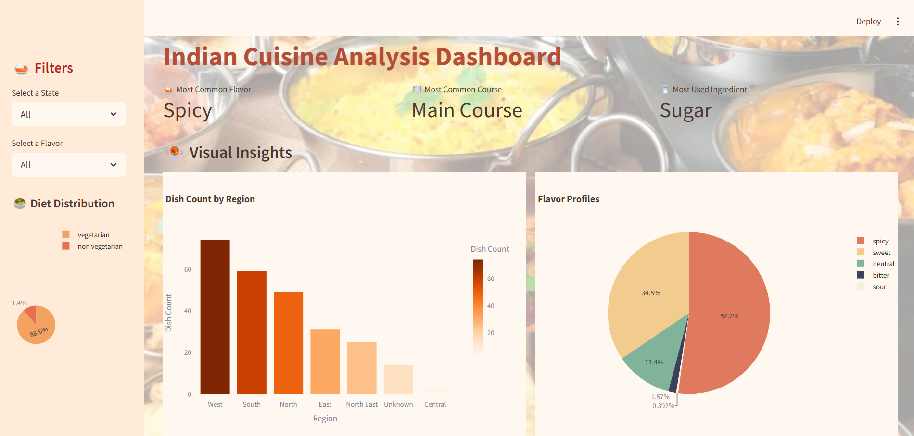
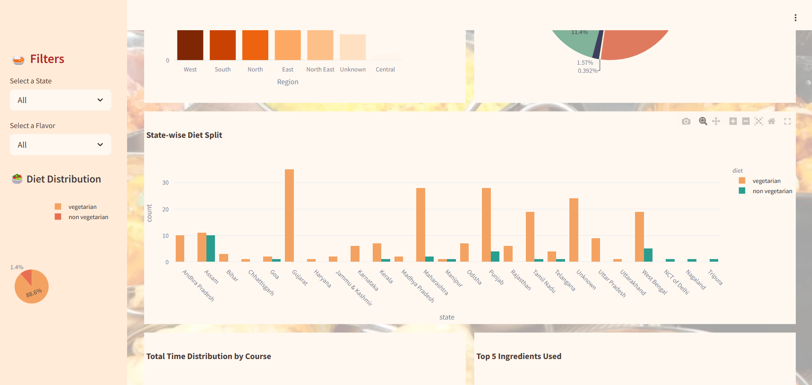
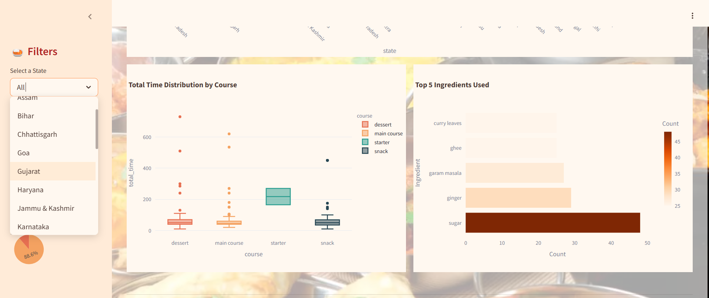

# Indian Cuisine Data Analysis 🍛



Welcome to a delicious dive into Indian cuisine! This project explores rich patterns and insights hidden in traditional Indian dishes using data analysis and interactive visualizations.

---

## 📌 Project Overview

We analyze and visualize a dataset of Indian dishes to uncover:
- Regional distribution of dishes (North, South, East, West, Central)
- Most commonly used ingredients
- Comparison between vegetarian and non-vegetarian dishes
- Preparation time across regions
- Flavor profiles like spicy, sweet, tangy, etc.

---

## 🧹 Data Cleaning

Initial data preprocessing was done in **Jupyter Notebook**, which included:
- Removing duplicates and nulls
- Standardizing region and ingredient names
- Creating new columns for analysis (e.g., total prep time, flavor categories)

---

## 📊 Interactive Dashboard

The final interactive dashboard was built using **Streamlit**. It allows users to:
- Explore dish counts by region
- View ingredient frequency word clouds
- Compare veg vs. non-veg dishes using pie charts
- Analyze prep time and popular ingredients per region
- Get an overview of dish flavor profiles

## Sample Visualizations



---

---
## 📁 Project Structure
```
Indian-cuisine-analysis/
├── app.py                      # Streamlit dashboard
├── indian_food_analysis.ipynb # Data cleaning and EDA
├── images/                    # Screenshots and visualizations
│   ├── dashboard_overview.png
│   ├── dish_count_by_region.png
│   └── veg_nonveg_pie.png
├── .gitignore
├── README.md
└── requirements.txt
```
---

## 🚀 Installation and Usage

### Clone the repository
```
git clone https://github.com/YourUsername/indian-cuisine-analysis.git
cd indian-cuisine-analysis
```

### (Optional) Create and activate a virtual environment
```
python -m venv venv
# On Windows
venv\Scripts\activate
# On macOS/Linux
source venv/bin/activate
```

### Install required packages
```
pip install -r requirements.txt
```

### Run the Streamlit dashboard
```
streamlit run app.py
```
---

## 📌 Conclusion
This project showcases how food can be analyzed just like data — uncovering regional trends, cultural patterns, and culinary habits across India. Whether you're a foodie or a data enthusiast, this dashboard serves up insights hot and fresh!

---
## 🙌 Contributions
Feel free to fork the repo and contribute with new visualizations, datasets, or improvements!


